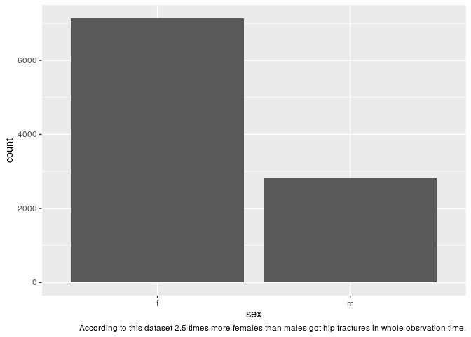
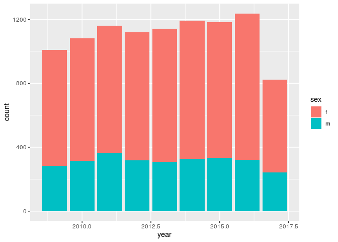
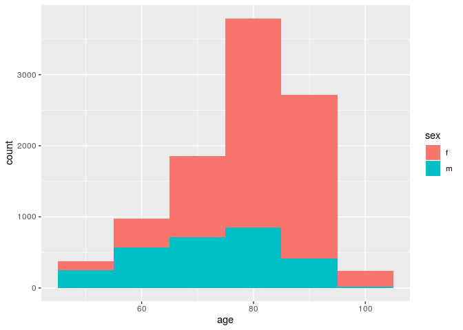
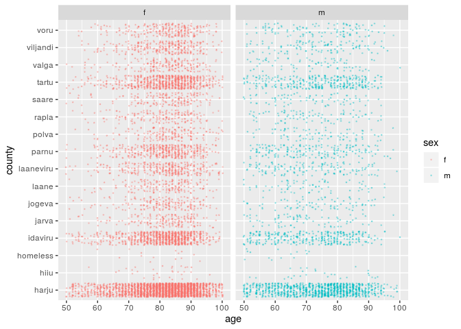
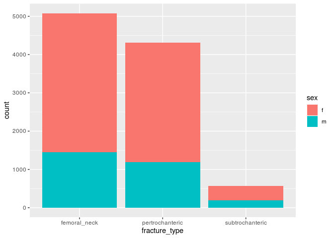
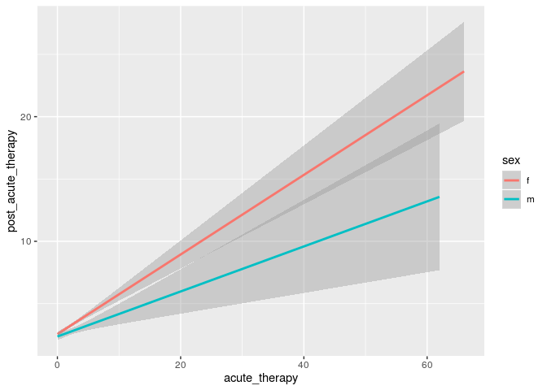

Homework
================
Jekaterina Nebogatova

``` r
library(tidyverse)
```

    ## ── Attaching packages ─────────────────────────────────────────── tidyverse 1.2.1 ──

    ## ✔ ggplot2 3.2.1     ✔ purrr   0.3.2
    ## ✔ tibble  2.1.3     ✔ dplyr   0.8.3
    ## ✔ tidyr   1.0.0     ✔ stringr 1.4.0
    ## ✔ readr   1.3.1     ✔ forcats 0.4.0

    ## ── Conflicts ────────────────────────────────────────────── tidyverse_conflicts() ──
    ## ✖ dplyr::filter() masks stats::filter()
    ## ✖ dplyr::lag()    masks stats::lag()

``` r
library(here)
```

    ## here() starts at /cloud/project

``` r
hf_summary <- read_csv("output/summary.csv")
```

    ## Parsed with column specification:
    ## cols(
    ##   .default = col_double(),
    ##   sex = col_character(),
    ##   county = col_character(),
    ##   date_of_fracture = col_date(format = ""),
    ##   fracture_type = col_character(),
    ##   operation_date = col_date(format = ""),
    ##   management_method = col_character(),
    ##   post_acute_type = col_character()
    ## )

    ## See spec(...) for full column specifications.

``` r
hf_summary
```

    ## # A tibble: 9,954 x 41
    ##       id sex     age county comorbidity myocardial_infa… congestive_hear…
    ##    <dbl> <chr> <dbl> <chr>        <dbl>            <dbl>            <dbl>
    ##  1     1 f        71 harju            2                0                0
    ##  2     2 f        99 vilja…           0                0                0
    ##  3     3 f        82 idavi…           1                0                1
    ##  4     4 f        98 harju            2                0                1
    ##  5     5 f        83 harju            0                0                0
    ##  6     6 m        51 idavi…           0                0                0
    ##  7     7 m        77 harju            5                1                1
    ##  8     8 f        82 parnu            5                1                1
    ##  9     9 f        87 tartu            2                0                1
    ## 10    10 f       100 harju            2                0                0
    ## # … with 9,944 more rows, and 34 more variables:
    ## #   peripheral_vascular_disease <dbl>, cerebrovascular_disease <dbl>,
    ## #   dementia <dbl>, chronic_pulmonary_disease <dbl>,
    ## #   rheumatic_disease <dbl>, peptic_ulcer_disease <dbl>, diabetes <dbl>,
    ## #   hemi_paraplegia <dbl>, renal_disease <dbl>, any_malignancy <dbl>,
    ## #   liver_disease <dbl>, metastatic_solid_tumor <dbl>, aids_hiv <dbl>,
    ## #   alcohol_abuse <dbl>, obesity <dbl>, psychoses <dbl>, depression <dbl>,
    ## #   date_of_fracture <date>, year <dbl>, fracture_type <chr>,
    ## #   operation_date <date>, days_to_operation <dbl>,
    ## #   operation_weekday <dbl>, management_method <chr>, acute_LOS <dbl>,
    ## #   acute_therapy <dbl>, post_acute_LOS <dbl>, post_acute_therapy <dbl>,
    ## #   post_acute_type <chr>, in_hospital_mortality <dbl>, time_3m <dbl>,
    ## #   status_3m <dbl>, time_12m <dbl>, status_12m <dbl>

## Plot1. Males/females with hip fracture.

``` r
ggplot(data = hf_summary) +
geom_bar(aes(x = sex)) +
  labs(caption = "According to this dataset 2.5 times more females than males got hip fractures in whole obsrvation time.")
```

<!-- -->

Result of plot 1.: According to this dataset 2,5 times more females than
males got hip fractures in whole obsrvation time.

\#Plot2. Amount of females/males who got hf by year.

``` r
ggplot(data = hf_summary) +
geom_bar (aes(x = year, fill = sex))
```

<!-- -->
\#Result of plot 2. Comparing to 2009-2016year less people got hf year
2017. Can be due to incomplete data.

\#Plot 3. Amount of females/males who got hf grouped by age.

``` r
ggplot(hf_summary, aes(age, fill = sex)) +
  geom_histogram(binwidth = 10)
```

<!-- -->
\#Result of plot 3. People at age 70-90 are more likely to get hf. But,
if you take into the account the life span of population, it would b
possible to say, that people older than 70 are more likely to get hf.
Reason of decrease of the amount of hf at age 90-100 can be small group
size.

\#Plot 4. Amount of males/females grouped by age and county.

``` r
ggplot(data = hf_summary, aes(x = age, y = county, color = sex)) +
  geom_point(size = 0.3, alpha = 0.3, position =  position_jitter(0.2))+
  facet_wrap (~ sex)
```

<!-- --> \#
Result of plot 4. Data correlates with plot 3. Not really relevant,
because gives information about amount of hf, not % of population.
Should be normalized to population of each county.

\#Plot 5. Amount of males/females with different type of hip fracture.

``` r
ggplot(hf_summary, aes(fracture_type, fill = sex)) +
  geom_bar()
```

<!-- --> \#
Result of plot 5. There is ~ 10 times more femoral neck or
pertrochanteric hfs, than cubtrochanteric hfs.

\#Plot6. Relation between acute therapy vs post acute therapy
time.

``` r
ggplot(data = hf_summary, aes(x = acute_therapy, y = post_acute_therapy, color = sex)) +
  geom_smooth(method = "lm")
```

<!-- -->
\#Result of plot 6. People who spent more time getting acute therapy are
more likely to spend more time getting post-acute therapy.
